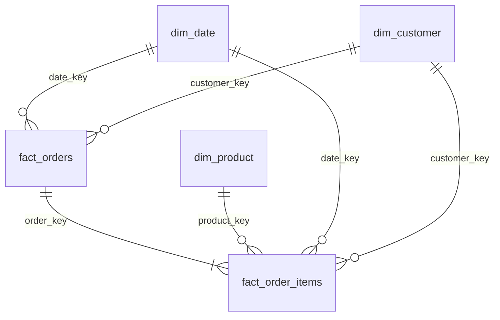

# Lakehouse Medallion — E-commerce Analytics Platform

> End-to-end data engineering platform: e-commerce event generation, streaming
> ingestion through Kafka, a Delta Lake lakehouse on MinIO organised as a
> Medallion architecture (Bronze / Silver / Gold), data quality with a
> quarantine, dimensional modelling with dbt, Airflow orchestration, tests and
> monitoring.

[](https://github.com/AymanMady/lakehouse-medallion/actions/workflows/ci.yml)
[]()
[]()
[]()
[]()
[]()
[]()
[](LICENSE)

---

## Contents

1. [Status](#status)
2. [Architecture](#architecture)
3. [Tech stack](#tech-stack)
4. [Getting started](#getting-started)
5. [Running the pipeline](#running-the-pipeline)
6. [The data](#the-data)
7. [The layers](#the-layers)
8. [Data quality and quarantine](#data-quality-and-quarantine)
9. [Data model](#data-model)
10. [Tests](#tests)
11. [Monitoring](#monitoring)
12. [Repository layout](#repository-layout)
13. [Useful commands](#useful-commands)
14. [Troubleshooting](#troubleshooting)
15. [Known limitations](#known-limitations)

---

## Status

Every phase is built and has been run end to end on the Docker stack.

| Phase | Contents | Where | Status |
|---|---|---|---|
| 1 | Architecture, repository, Docker | [docker-compose.yml](docker-compose.yml), [docker/](docker/) | ✅ |
| 2 | Synthetic data generator, with injected defects | [ingestion/generator/](ingestion/generator/) | ✅ |
| 3 | Kafka producer and topic inspector | [ingestion/producers/](ingestion/producers/), [ingestion/consumers/](ingestion/consumers/) | ✅ |
| 4 | Bronze: Kafka → Delta on MinIO, incremental | [spark/jobs/bronze/](spark/jobs/bronze/) | ✅ |
| 5 | Silver: parse, deduplicate, cast, repair | [spark/jobs/silver/](spark/jobs/silver/) | ✅ |
| 6 | Data quality rules, quarantine, quality gate | [spark/common/data_quality.py](spark/common/data_quality.py), [spark/jobs/silver/rules.py](spark/jobs/silver/rules.py) | ✅ |
| 7 | Gold: star schema | [spark/jobs/gold/](spark/jobs/gold/) | ✅ |
| 8 | dbt marts and tests | [dbt/](dbt/) | ✅ |
| 9 | Airflow DAG | [airflow/dags/lakehouse_pipeline.py](airflow/dags/lakehouse_pipeline.py) | ✅ |
| 10 | Unit, Spark integration and dbt tests; CI | [tests/](tests/), [dbt/tests/](dbt/tests/), [.github/workflows/](.github/workflows/ci.yml) | ✅ |
| 11 | Monitoring: run history, drift, volume, freshness alerts | [spark/common/monitoring.py](spark/common/monitoring.py), [spark/jobs/monitoring/](spark/jobs/monitoring/) | ✅ |
| 12 | Documentation | this file, [docs/architecture.md](docs/architecture.md) | ✅ |

---

## Architecture

See [docs/architecture.md](docs/architecture.md) for the full diagram, how the
work is split between Spark and dbt, and the architecture decisions.

```
                                  ┌──▶ QUARANTINE (rejects + reason)
                                  │
Generator ──▶ Kafka ──▶ BRONZE ──▶ SILVER ──▶ GOLD ──▶ dbt marts ──▶ BI / SQL
 (Python)    (KRaft)    (raw)     (clean)   (star      (KPIs)
                                             schema)
   └──────────────── orchestrated by Airflow, one container per step ───────────┘
                     every run recorded in MONITORING (quality, volume)
```

| Layer | Written by | Rule |
|---|---|---|
| **Bronze** | Spark | Never alter the source data. Append-only, everything stays text. |
| **Silver** | Spark | A Silver row is a row whose validity can be proven. |
| **Quarantine** | Spark | An invalid row is never deleted, only isolated, with its reason. |
| **Gold** | Spark (star schema) + dbt (marts) | Business vocabulary only. |
| **Monitoring** | every Spark job | Append-only history of every run. |

## Tech stack

| Component | Version | Role |
|---|---|---|
| Python | 3.12 | pipeline language |
| Apache Spark | 3.5.9 | distributed compute engine |
| Delta Lake | 3.3.2 | ACID table format |
| Apache Kafka | 3.9.0 (KRaft) | event bus |
| MinIO | S3-compatible | data lake object storage |
| dbt-core / dbt-spark | 1.9 | SQL modelling of the Gold marts |
| Apache Airflow | 2.10.5 | orchestration |
| PostgreSQL | 16 | Airflow metadata + Hive Metastore |

> ⚠️ **These versions are locked together:** Spark 3.5.9 ⇄ Delta 3.3.2 ⇄
> hadoop-aws 3.3.4 ⇄ aws-java-sdk-bundle 1.12.262. Changing one without the
> others raises `ClassNotFoundException` / `NoSuchMethodError`.

---

## Getting started

### Requirements

- Docker Engine ≥ 24 and Docker Compose v2
- 8 GB of free RAM for the full stack (4 GB for the core services alone)
- ~12 GB of disk space (images + data)
- `make`, `openssl`, `curl`

### Start the stack

```bash
make init     # 1. generate .env with random secrets
make build    # 2. build the custom images (~10 min the first time)
make up       # 3. start the stack
make health   # 4. check that every service answers
make smoke    # 5. write/read a Delta table on MinIO: ACID, time travel, metastore
make creds    # 6. print the credentials for the web interfaces
```

For a lightweight start (MinIO + PostgreSQL + Kafka only): `make up-core`.

Expected output of `make smoke`:

```
  [OK]   Delta extensions loaded
  [OK]   Write Delta to MinIO (s3a)
  [OK]   Read Delta from MinIO
  [OK]   Delta UPDATE (ACID)
  [OK]   Delta time travel
  [OK]   Hive Metastore on PostgreSQL
  6 passed, 0 failed
```

Measured cold start: **~75 s** (11 long-running services + 4 init jobs).

### Web interfaces

| Interface | URL |
|---|---|
| MinIO Console | http://localhost:19001 |
| Kafka UI | http://localhost:18085 |
| Spark Master | http://localhost:18081 |
| Spark Worker | http://localhost:18082 |
| Airflow | http://localhost:18088 |
| PostgreSQL | `localhost:15432` |
| Spark Thrift (JDBC) | `localhost:10000` |
| Kafka (from the host) | `localhost:29092` |

> Host ports are deliberately shifted into the `1xxxx` range so the stack can
> run alongside other Docker stacks. All of them can be changed in `.env`.

---

## Running the pipeline

### In one command

```bash
make pipeline            # generate -> Kafka -> Bronze -> Silver -> Gold -> dbt -> health report
make pipeline p=medium   # a bigger dataset (tiny | small | medium | large)
```

Every Spark job of one `make pipeline` shares a `RUN_ID`, so the monitoring
history groups them together.

### Step by step

| Command | Phase | What it does |
|---|---|---|
| `make generate p=small` | 2 | writes `data/raw/<entity>.jsonl`, defects included |
| `make produce` | 3 | publishes them to one Kafka topic per entity |
| `make inspect t=orders` | 3 | offsets per partition and a few sample messages |
| `make bronze` | 4 | ingests the **new** Kafka messages into `bronze.*` |
| `make silver` | 5–6 | `bronze.*` → `silver.*` + `quarantine.*`, quality gate at 80% |
| `make gold` | 7 | `silver.*` → star schema in `gold.*` |
| `make dbt-run` | 8 | builds the four marts in `gold.mart_*` |
| `make dbt-test` | 8 | runs the 44 dbt tests |
| `make monitor` | 11 | health report: quality drift, Gold volume, freshness |

### With Airflow

```bash
make dag-trigger         # unpause and trigger `lakehouse_pipeline`
```

The DAG runs daily at 02:00 UTC:

```
start → generate_events → publish_to_kafka → bronze_ingest → silver_transform
      → gold_star_schema → dbt_run → dbt_test → pipeline_health → end
```

Airflow never runs Spark or dbt in its own process: each task is a sibling
container started with the `DockerOperator`, in exactly the image it was built
and tested for. `silver_transform` fails when an entity's valid ratio drops
below 80%, and `pipeline_health` fails when a monitoring alert fires — a
pipeline that always succeeds is one that checks nothing.

### Querying the result

```bash
make spark-sql
```

```sql
SELECT year_month, country, revenue, revenue_change_pct
FROM gold.mart_monthly_revenue ORDER BY year_month DESC, revenue DESC LIMIT 12;

SELECT rfm_segment, count(*) AS customers, round(sum(monetary)) AS revenue
FROM gold.mart_customer_rfm GROUP BY rfm_segment ORDER BY revenue DESC;

SELECT entity, rejection_reasons, injected_corruption
FROM quarantine.orders LIMIT 10;
```

Any JDBC/HiveServer2 client (DBeaver, a BI tool) can connect to the Spark
Thrift Server on `localhost:10000`.

---

## The data

[`ingestion/generator/generate.py`](ingestion/generator/generate.py) produces
six related entities — `customers`, `products`, `orders`, `order_items`,
`payments`, `shipments` — that hold together: an order points at a customer
that exists, its total is the sum of its lines, a pending order has no payment,
a cancelled one has no shipment. The domain contract (fields, types, keys,
reference values) is defined once in
[`ingestion/generator/schemas.py`](ingestion/generator/schemas.py) and imported
by the generator, the producer, the Spark jobs and the tests.

The same seed gives the same dataset, so two pipeline runs can be compared.

Then it **breaks a controlled share of the records on purpose** — a clean
dataset would prove nothing:

| Defect | Default rate | Handled by |
|---|---|---|
| null in a nullable field | 3% | Silver repair (or accepted) |
| exact duplicate event | 2% | Silver deduplication on `event_id` |
| invalid value (20 kinds) | 2% | Silver rules → quarantine (18) or repair (2) |

Invalid values include an unknown currency, an unparseable date, a negative
quantity, a discount above 100%, a delivery before shipping, and orphans
(an order for a customer that does not exist). Each corrupted record carries a
`_corruption` marker, which lets the tests check that **the right rule** caught
it.

Every record travels inside an envelope (`event_id`, `event_type`, `entity`,
`occurred_at`, `source`, `payload`). Kafka messages are keyed on the business
key, so all events about one order land in the same partition, in order.

---

## The layers

### Bronze — [ingest_kafka.py](spark/jobs/bronze/ingest_kafka.py)

The raw Kafka message, untouched: the payload as JSON text, the full message,
the Kafka partition/offset/timestamp and an `ingestion_timestamp`. Partitioned
by `ingestion_date`.

`--mode batch` reads **only the messages that arrived since the previous run**:
it is a Structured Streaming query with the `availableNow` trigger and a
checkpoint on MinIO, so it stops by itself once caught up and never ingests a
message twice. `--mode stream` runs the same query continuously, with the same
checkpoint.

### Silver — [bronze_to_silver.py](spark/jobs/silver/bronze_to_silver.py)

Nine steps, in an order that matters:

1. read Bronze (everything is text)
2. parse the payload JSON — as strings, so "absent" and "unparseable" stay distinguishable
3. deduplicate on `event_id` — the same message delivered twice
4. cast to the target types — a failed cast becomes NULL, and is then caught
5. repair cosmetic anomalies
6. validate against the rules
7. check referential integrity — orphans are flagged `fk_orphan_<field>`
8. deduplicate on the business key — keep the latest version
9. `MERGE` the valid rows into Silver (idempotent), write the rejects to quarantine

Entities are processed in dependency order (customers and products before
orders, orders before their lines), because a foreign key can only be checked
against a table that already exists.

### Gold — [build_star_schema.py](spark/jobs/gold/build_star_schema.py) and [dbt/](dbt/)

Spark builds the **physical** star schema (row-level work on the Delta tables);
dbt builds the **semantic** layer on top — business aggregates in SQL, versioned,
documented and tested. dbt declares the star schema as a `source` rather than
rebuilding it.

---

## Data quality and quarantine

Two policies, never to be confused ([rules.py](spark/jobs/silver/rules.py)):

- **REPAIR** — a cosmetic anomaly: the row stays, the field is fixed.
  A malformed email becomes NULL, an unknown country becomes `Unknown`, a
  missing discount becomes 0, a missing channel becomes `unknown`.
- **REJECT** — the row is unusable: it goes to quarantine with every rule it
  violated. The criterion is business, not technical: an order whose customer
  email is broken still counts towards revenue; an order with no date does not.

| Entity | Rejection rules |
|---|---|
| customers | missing id or signup date, unknown segment, signup in the future |
| products | missing id or price, price ≤ 0, negative cost, cost above price, empty category |
| orders | missing id / customer / timestamp, unknown status / channel / currency, negative total, timestamp in the future, unknown customer |
| order_items | missing ids or quantity, quantity ≤ 0, negative price, discount outside [0, 1], unknown order or product |
| payments | missing ids or amount, negative amount, unknown method or status, unknown order |
| shipments | missing ids, unknown status, delivered before shipped, unknown order |

The framework ([data_quality.py](spark/common/data_quality.py)) evaluates all
the rules in **one pass**, records **every** violated rule (not just the
first), and treats a NULL condition as a violation — in SQL `NULL > 0` is not
false, and without that a missing quantity would slip through as valid.

The quarantine keeps the rejection reasons, the original payload and the
injected corruption, so you can decide whether the data is wrong or the rule is
too strict, and replay it once the source is fixed.

**Quality gate.** Each entity's *valid ratio* — valid rows over the distinct
rows checked — must stay above `--min-valid-ratio` (0.80 by default), or the
job fails and the pipeline stops. Duplicates are left out of that ratio: Kafka
delivers at least once and every run re-emits the same entities, so they are
expected, not bad data. The accounting always balances:
`rows_read = valid + quarantined + duplicates`.

---

## Data model



| Table | Grain | Highlights |
|---|---|---|
| `dim_date` | one day | generated calendar, no holes by construction |
| `dim_customer` | one customer | `signup_cohort`, `tenure_days`, `is_contactable` |
| `dim_product` | one product | `unit_margin`, `margin_pct` |
| `fact_orders` | one order | `revenue` (0 unless paid/shipped/delivered), `declared_amount` vs `computed_amount` and their `amount_gap` |
| `fact_order_items` | one order line | `gross_amount`, `net_amount`, `cost_amount`, `revenue`, `margin` |

A cancelled or returned order still **exists** — it keeps its quantity and
counts as an order — it simply brings in no revenue.

The dbt marts, in `gold.mart_*`:

| Mart | Grain | Content |
|---|---|---|
| `mart_daily_sales` | one calendar day, including days with no order | orders, customers, units, revenue, margin, discounts, average order value |
| `mart_monthly_revenue` | month × country | revenue, margin, month-over-month change |
| `mart_product_performance` | one product | revenue, margin, rank in its category and overall |
| `mart_customer_rfm` | one customer with revenue | recency / frequency / monetary scores (quintiles) and segment |

---

## Tests

| Suite | Command | Runs in | Count |
|---|---|---|---|
| Unit (contract, generator) | `make test` | the Python image, ~1 s | 26 |
| Spark integration (quality framework, Silver, Gold) | `make test-integration` | the Spark image, ~1 min | 49 (+ the 26 unit tests) |
| dbt (schema and singular tests) | `make dbt-test` | against the real Gold tables | 44 |

- **Unit tests** check the consistency of the domain contract and the
  generator: reproducibility, well-formed envelopes, duplicates that really are
  duplicates, order totals equal to the sum of their lines.
- **Integration tests** run the real Spark code on in-memory DataFrames — no
  MinIO, Kafka or metastore. The Silver suite feeds generated events through
  the real Silver steps and checks, for each of the 18 kinds of defect that
  must be rejected, that it is caught by **its own** rule; that cosmetic defects are
  repaired, not rejected; that a clean row is only ever rejected as the orphan
  of a rejected parent; and that duplicates collapse.
- **dbt tests** check keys, relationships and accepted values, plus singular
  tests for business rules: no revenue on cancelled orders, margin never above
  revenue, the daily mart reconciling with the facts, the grain of the monthly
  mart, and the direction of the RFM recency score.

CI ([.github/workflows/ci.yml](.github/workflows/ci.yml)) lints the Python code
with ruff, checks the shell scripts parse, runs the unit tests, and validates
`docker-compose.yml`.

---

## Monitoring

Every run leaves a trace in the lake itself, as Delta tables any SQL client can
query ([monitoring.py](spark/common/monitoring.py)):

| Table | One row per | Content |
|---|---|---|
| `monitoring.quality_runs` | Silver entity × run | rows read / valid / quarantined / duplicated, valid ratio, threshold, passed, count per rule |
| `monitoring.metrics` | layer × subject × metric × run | Bronze events ingested, Gold row counts, revenue, lines lost in joins, orders whose declared total differs from their lines |

Both are append-only. A run that fails its quality gate is recorded **before**
the job fails — it is the one you most want to find afterwards.

`make monitor` ([pipeline_report.py](spark/jobs/monitoring/pipeline_report.py))
compares the latest run with the previous one and raises an alert when:

| Check | Default threshold | Option |
|---|---|---|
| an entity failed its quality gate | — | — |
| a valid ratio dropped since the previous run | 5 points | `--max-ratio-drop` |
| a Gold table lost rows since the previous run | 20% | `--max-row-drop` |
| Bronze has received nothing for too long | 26 h | `--max-age-hours` |

In the DAG it runs with `--fail-on-alert`, so an alert fails the run.

```sql
-- the valid ratio of orders, run after run
SELECT run_id, recorded_at, valid_ratio, rows_invalid, failures_by_rule
FROM monitoring.quality_runs WHERE dataset = 'orders' ORDER BY recorded_at DESC;
```

Operational health (containers, ports, Kafka, Spark, Airflow) is covered by
`make health`, and each service has its own UI (see [Web interfaces](#web-interfaces)).

---

## Repository layout

```
lakehouse-medallion/
├── docker-compose.yml          # the whole infrastructure
├── Makefile                    # every command: stack, pipeline, tests
├── .env.example                # configuration (secrets generated by make init)
│
├── docker/                     # custom images
│   ├── spark/                  #   Spark 3.5.9 + Delta + S3A + Kafka
│   ├── airflow/                #   Airflow 2.10.5
│   ├── dbt/                    #   dbt-core + dbt-spark
│   ├── python/                 #   generator / producer / unit tests
│   └── postgres/               #   databases + Hive Metastore schema
│
├── ingestion/
│   ├── generator/              # domain contract + synthetic data with defects
│   ├── producers/              # Kafka producer
│   └── consumers/              # topic inspector
│
├── spark/
│   ├── common/                 # config, session, schemas, data quality, monitoring
│   └── jobs/
│       ├── bronze/             # Kafka   -> Bronze
│       ├── silver/             # Bronze  -> Silver + quarantine, and the rules
│       ├── gold/               # Silver  -> star schema
│       └── monitoring/         # health report and alerts
│
├── dbt/                        # marts, tests, macros
├── airflow/dags/               # the pipeline DAG
├── scripts/                    # bootstrap, MinIO/Kafka/metastore init, health, reset
├── tests/
│   ├── unit/                   # pure Python
│   └── integration/            # PySpark, run in the Spark image
└── docs/                       # architecture and decisions
```

---

## Useful commands

```bash
make help              # list every command
make ps                # container status
make logs s=kafka      # logs of one service
make health            # end-to-end check of the services
make topics            # list the Kafka topics
make ls-lake           # contents of the lakehouse bucket
make pyspark           # PySpark shell wired to Delta + MinIO
make spark-sql         # Spark SQL shell on the catalog
make psql              # PostgreSQL client
make reset             # empty topics, lake and catalog; keep the containers (destructive)
make down              # stop (data is kept)
make clean             # stop + delete the volumes (destructive)
```

---

## Troubleshooting

### `pull access denied for minio/mc`
The MinIO images are **no longer published on Docker Hub**; they live on
`quay.io`. The `docker-compose.yml` already uses `quay.io/minio/minio` and
`quay.io/minio/mc`.

### `address already in use` on startup
Another service holds the port. Find the culprit, then change the value in
`.env`:

```bash
ss -ltnp | grep 19000        # who is listening?
docker ps --format '{{.Names}}\t{{.Ports}}'
```

### Image name collisions between projects
Images are prefixed `lakehouse-medallion/` (not `lakehouse/`) so they never
overwrite those of another local project with a similar name:
`docker images | grep lakehouse-medallion`.

### `ClassNotFoundException: org.apache.hadoop.fs.s3a.S3AFileSystem`
The `hadoop-aws` JAR does not match the Hadoop version bundled in Spark. Those
versions are pinned in [docker/spark/Dockerfile](docker/spark/Dockerfile):
`hadoop-aws 3.3.4` + `aws-java-sdk-bundle 1.12.262` for Spark 3.5.9.

### `DeltaAnalysisException` / Delta extensions missing
Check that `spark.sql.extensions` is actually set:

```bash
docker compose exec spark-master grep extensions /opt/spark/conf/spark-defaults.conf
```
That file is **generated at startup** by `entrypoint.sh` from the template. If
it is empty, the environment variables are not reaching the container.

### `Required table missing: TBL_PRIVS`, or Spark hangs on startup
The Hive Metastore schema is not initialised. It is loaded **once**, on the
first PostgreSQL boot, from the official Hive DDL
([02-init-hive-metastore.sh](docker/postgres/init/02-init-hive-metastore.sh)).
Check with:

```bash
docker compose exec postgres psql -U lakehouse -d metastore \
  -c 'SELECT "SCHEMA_VERSION" FROM "VERSION";'      # should return 2.3.0
```

If the database already existed before this fix, recreate it with
`make clean && make up`.

> Never enable `datanucleus.schema.autoCreateAll` for every job: creation is
> **lazy** (tables go missing later) and **not concurrency-safe** (two
> simultaneous Spark applications deadlock PostgreSQL).

### `Table or view not found: monitoring.…`
The `monitoring` database is registered by `metastore-init`. On a stack
started before phase 11, run `docker compose up -d spark-master` (which re-runs
it) — the jobs also create it on their first write.

### `silver_transform` fails with `valid ratio … < threshold`
That is the quality gate doing its job. See which rule dominates in the task
log or in `monitoring.quality_runs`, then look at the rejected rows in
`quarantine.<entity>`. Lower `--min-valid-ratio` only if the rule is wrong, not
the data.

### Airflow cannot write its logs
`AIRFLOW_UID` in `.env` must match your host UID (`id -u`).

### `The user that Airflow is running as has no username`
The official entrypoint of the Airflow image was bypassed. That entrypoint is
what registers an arbitrary `AIRFLOW_UID` in `/etc/passwd`. The `airflow-init`
service must end with `exec /entrypoint ...` and run as `user: "0:0"`.

### dbt fails with no message (`rc=2`)
The dbt container cannot write `target/` and `logs/` in the mounted folder.
`HOST_UID` / `HOST_GID` in `.env` must match your user (`id -u && id -g`).

### `make test-integration` fails with `No module named pytest`
The Spark image predates the test dependencies: `docker compose build spark-master`.

### Not enough RAM
Reduce the profiles in `.env`, e.g. `COMPOSE_PROFILES=spark` (core + Spark only).

---

## Known limitations

- **`dbt run --full-refresh` does not work** on this stack: `CREATE OR REPLACE`
  on Delta fails through the Thrift server, and S3A leaves a directory marker
  that stops a dropped table from being re-created. The marts are therefore
  incremental with `insert_overwrite`. To rebuild from scratch, use
  `make reset`. Details in [dbt/macros/create_table_as.sql](dbt/macros/create_table_as.sql).
- **Silver reprocesses the whole of Bronze** on every run. It is correct —
  deduplication and the `MERGE` make it idempotent — but its cost grows with
  Bronze. The next step would be incremental reads through Delta's change data
  feed.
- **Bronze grows with every DAG run**, because the daily generator re-emits the
  same entities under new `event_id`s. Bronze itself never ingests a message
  twice; the re-emissions are deduplicated in Silver on the business key.
- **Spark jobs run in `local[2]`** inside one-off containers rather than on the
  standalone cluster: simpler for the driver/executor networking, and not
  slower at this volume.

---

## Security

No password is committed. `make init` generates `.env` with random secrets
(`openssl rand`), and `.env` is ignored by Git. Containers receive their secrets
through environment variables; `spark-defaults.conf` is rendered from a template
when the container starts.

---

## License

MIT — see [LICENSE](LICENSE).
