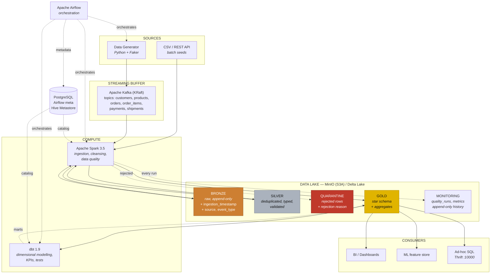

# Architecture — Lakehouse Medallion

## 1. Overview

## 2. What each layer is responsible for

| Layer | Engine | Input | Output | Golden rule |
|---|---|---|---|---|
| **Bronze** | Spark (Structured Streaming + batch) | Kafka, CSV | Delta, partitioned by `ingestion_date` | *Never alter the source data.* Append-only. |
| **Silver** | Spark (PySpark) | Bronze Delta | Delta, one table per entity | *A Silver row is a row whose validity can be proven.* |
| **Quarantine** | Spark | Silver (rejects) | Delta + `rejection_reason` | *An invalid row is never deleted, only isolated.* |
| **Gold** | Spark (star schema) + dbt (marts) | Silver Delta | Delta, star schema + marts | *Business vocabulary only.* |
| **Monitoring** | every Spark job | job results | Delta, append-only | *Every run leaves a trace, including the failed ones.* |

## 3. Splitting the work between Spark and dbt

| Task | Tool | Why |
|---|---|---|
| Consume Kafka | **Spark** | Structured Streaming, checkpointing, exactly-once |
| Parse malformed JSON | **Spark** | row-by-row control, exception handling |
| Route to quarantine | **Spark** | conditional write to two destinations |
| Deduplicate / `MERGE INTO` | **Spark** | programmatic Delta API |
| Build the star schema (dimensions, facts) | **Spark** | row-level joins on the full Silver tables, measured join losses |
| Compute the marts (`mart_daily_sales`, RFM...) | **dbt** | pure SQL aggregates and window functions, easy to review |
| Test `not_null` / `unique` / business rules | **dbt** | declarative tests in YAML, singular tests in SQL |
| Record quality and volume per run | **Spark** | written by the jobs that know the numbers |

## 4. Exposed ports

| Service | Host URL / port | Role |
|---|---|---|
| MinIO API | `localhost:19000` | S3 endpoint |
| MinIO console | `localhost:19001` | bucket browser |
| Kafka (external) | `localhost:29092` | bootstrap from the host |
| Kafka UI | `localhost:18085` | topics, messages, consumer groups |
| Spark master UI | `localhost:18081` | workers, applications |
| Spark worker UI | `localhost:18082` | executors |
| Spark app UI | `localhost:4040` | jobs, stages, SQL plans |
| Spark Thrift | `localhost:10000` | JDBC/HiveServer2 for dbt |
| Airflow | `localhost:18088` | DAGs, logs, runs |
| PostgreSQL | `localhost:15432` | airflow / metastore / analytics |

Host ports are shifted into the `1xxxx` range so the stack can run alongside
other local Docker stacks. The ports **inside** the Docker network stay standard
(`minio:9000`, `kafka:9092`, `postgres:5432`, `spark-master:7077`).

## 5. Traps hit while building this

These problems were actually hit and fixed. They are worth knowing: the same
ones show up in production.

| Symptom | Real cause | Fix |
|---|---|---|
| `pull access denied for minio/mc` | MinIO no longer publishes to Docker Hub | images pulled from `quay.io` |
| Spark build stalling after 40 min | `archive.apache.org` throttled to ~150 KB/s | `dlcdn.apache.org` (CDN) with fallback; Spark 3.5.9 is there, 3.5.3 is not |
| `AccessDeniedException: /opt/spark/work` | non-root worker on a root-owned folder | `work/` and `logs/` chowned at build time |
| Spark applications hanging forever | two apps creating the metastore schema in parallel → PostgreSQL deadlock | official Hive DDL loaded once at PostgreSQL boot |
| `Required table missing: TBL_PRIVS` | `autoCreateAll` creates tables **lazily** | same as above |
| `Airflow has no username` | official entrypoint bypassed | `exec /entrypoint`, service runs as `user: "0:0"` |
| dbt failing silently (`rc=2`) | container uid ≠ bind mount owner | dbt runs as `HOST_UID:HOST_GID` |
| Bronze doubling on every run | a batch `spark.read` of Kafka has no memory and restarts from the first offset | `availableNow` trigger + checkpoint: batch semantics, streaming bookkeeping |
| `'path' is not specified` on a Delta stream | `writeStream.start()` without a destination | `.option("path", ...)` on the writer |
| Silver gate failing on the 2nd run of unchanged data | duplicates counted in the valid ratio's denominator, rejects never deduplicated | ratio over distinct checked rows; rejects deduplicated on the business key |
| Freshness showing a negative age | `collect()` converts timestamps to the container's local time zone, not the session's UTC | age computed inside Spark |

## 6. Architecture decisions

| Decision | Alternative rejected | Reason |
|---|---|---|
| Kafka in **KRaft** mode | Kafka + ZooKeeper | one container fewer, default mode since Kafka 3.5 |
| Hive Metastore on **PostgreSQL over JDBC** | dedicated Hive Metastore service | one service fewer, no loss of functionality |
| Metastore schema loaded **once** from the official Hive DDL | `datanucleus.autoCreateAll` on every job | auto-creation is lazy (missing tables) and deadlocks under concurrency |
| **One** PostgreSQL, 3 databases | 3 PostgreSQL containers | simpler, same isolation guarantees |
| Airflow **LocalExecutor** | CeleryExecutor + Redis | 2 containers instead of 5, enough for local work |
| Airflow → **DockerOperator** | Spark installed in the Airflow image | lightweight Airflow image, each job in its own runtime |
| JARs **frozen into the image** | `--packages` at runtime | reproducible build, works offline |
| Spark image built from **python:3.12** | official `apache/spark` | Python 3.12 everywhere (the official image ships 3.10) |
| Images prefixed `lakehouse-medallion/` | `lakehouse/` | avoids overwriting another local project's images |
| MinIO images from **quay.io** | Docker Hub | MinIO no longer publishes to Docker Hub |
| Host ports in the `1xxxx` range | standard ports | coexistence with other local Docker stacks |
| dbt / datagen running as `HOST_UID` | the image's own user | they write into folders bind-mounted from the host |
